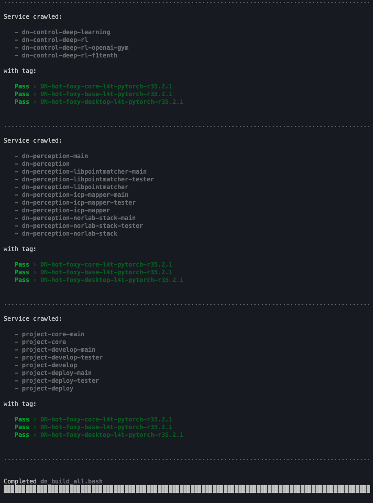

<div align="center">

[//]: # ( ==== Logo ================================================== )
<br>
<br>
<a href="https://norlab.ulaval.ca">
    <picture>
      <source media="(prefers-color-scheme: dark)" srcset="/visual/norlab_logo_acronym_light.png">
      <source media="(prefers-color-scheme: light)" srcset="/visual/norlab_logo_acronym_dark.png">
      
    </picture>
</a>
<br>
<br>

[//]: # ( ==== Title ================================================= )
# _Dockerized-NorLab_


[//]: # ( ==== Hyperlink ============================================= )
<sup>
<a href="http://132.203.26.125:8111">NorLab TeamCity GUI</a>
(VPN/intranet access) &nbsp; • &nbsp;
<a href="https://hub.docker.com/repositories/norlabulaval">norlabulaval</a>
(Docker Hub) &nbsp;
<a href="https://github.com/dusty-nv/jetson-containers">Jetson-Containers</a> 
&nbsp; • &nbsp;
</sup>
<br>
<br>

[//]: # ( ==== Description =========================================== )

**Containerized development workflow for NorLab perception or control projects
<br>
leveraging [_docker_](https://www.docker.com) and [_nvidia-docker_](https://github.com/NVIDIA/nvidia-container-toolkit)
technology.**
<br>
<br>

[//]: # ( ==== Badges ================================================ )

[](https://github.com/semantic-release/semantic-release)

<a href="http://132.203.26.125:8111"></a>

<br>

[//]: # ( ==== Maintainer ============================================ )
<sub>
Maintainer <a href="https://redleader962.github.io">Luc Coupal</a>
</sub>

<br>
<hr style="color:lightgray;background-color:lightgray">
</div>


[//]: # ( ==== Body ================================================== )

## Features
- CUDA support via _nvidia-docker_
- Multi architectures: `l4t/arm64`, `linux/amd64`
- Multi OS versions:
  - Jetpack: `r35.2.1`, `r35.4.1`, `r36.2.8` ...
  - Ubuntu: `focal`, `jammy`
- Multi ros2 distros: `foxy`, `humble` ...
- Multi ros2 packages: `core`, `base`, `desktop`
- Multi packages (non-exhaustive list): 
  - Numerical computing: `numpy`, `numba`, `pycuda`, `tensorrt`
  - Deep-learning: `pytorch`, `torch2trt`, `tensordict`
  - Vision: `opencv`, `torchvision`
  - NorLab perception stack: `libpointmatcher[-ros]`, `norlab-icp-mapper[-ros]` 
  - NorLab control stack: (in progress) 
  - MLOps: `ray`, `omegaconf`, `hydra-core`, `wandb`
  - Deep-rl: `stable-baseline3`
  - Simulation: `gym`, `f1tenth-gym`
 
## Why
1. custom dependency management; 
2. development environment consistency; 
3. codebase stabilization trough continuous integration pipeline;
4. easy deployment to robots compute box;
5. results reproducibility.
 
Recommanded reading by [Tobit Flatscher](https://github.com/2b-t)
- [Why should I use Docker when developing robotics software?](https://github.com/2b-t/docker-for-robotics/blob/main/doc/Motivation.md#2-why-should-i-use-docker-when-developing-robotics-software)
- [Why is Docker important in particular for academic and research institutions?](https://github.com/2b-t/docker-for-robotics/blob/main/doc/Motivation.md#3-why-is-docker-important-in-particular-for-academic-and-research-institutions)


---

# Basic usage
Note: _**Dockerized-Norlab**_ images are intended to be used as base images for **_Dockerized-NorLab-Project_**

1. Pick an images that fit your project, the most basic one is [dockerized-norlab-dependencies-full](https://hub.docker.com/repository/docker/norlabulaval/dockerized-norlab-dependencies-full)
2. Pick the tag that fit your needs, e.g. `DN-bleeding-foxy-base-l4t-pytorch-r35.4.1`  
   Notes: `bleeding` is for the DN `dev` branch, `foxy` is the ros version, `base` is the ROS package type, `l4t-pytorch` is the Jetson container pkg, `r35.4.1` is the _Jetpack_ version 
3. Pull the image from _Dockerhub_
    ```shell
    docker pull norlabulaval/dockerized-norlab-dependencies-full:DN-bleeding-foxy-base-l4t-pytorch-r35.4.1
    ```
4. Pull the image from _Dockerhub_
    
   ```shell
    docker run -it --rm \
        --env ROS_DOMAIN_ID=1 --env DISPLAY="${DISPLAY}" --env QT_X11_NO_MITSHM=1 \
        --net host -p 2222:2222 -p 6006:6006 -p 7777:7777 \
        --privileged \
        -v /etc/localtime:/etc/localtime:ro -v /tmp/.X11-unix:/tmp/.X11-unix:rw -v /tmp/.docker.xauth:/tmp/.docker.xauth:rw \
        norlabulaval/dockerized-norlab-dependencies-full:DN-bleeding-foxy-base-l4t-pytorch-r35.4.1
    ``` 
    Note: 
    - Add the `--runtime nvidia` flag if you have nvidia gpu and _nvidia-docker_ is installed.
    - For _MacOs_ user, replace the line `--net host -p 2222:2222 -p 6006:6006 -p 7777:7777` with `--net bridge`. 


---

# Available images

Notes:
- All images also have a tag pinned for each release version, starting from release v0.5.2, e.g. `DN-v0.5.2-foxy-ros-core-l4t-r35.2.1`.
- Bleeding tags are build from the latest `dev` branch version (e.g. `DN-bleeding-foxy-base-l4t-pytorch-r35.4.1`) and are rebuild each week. 
- All images are multi-architecture build (amr64 and amd64). 
- Most have CUDA support via _nvidia-docker_ base image, both for L4T (aka Jetson OS) and ubuntu.


### Dockerized-Norlab Perception
#### [dockerized-norlab-perception-stack](https://hub.docker.com/repository/docker/norlabulaval/dockerized-norlab-perception-stack)  
  
  
  

#### [dockerized-norlab-perception-libpointmatcher](https://hub.docker.com/repository/docker/norlabulaval/dockerized-norlab-perception-libpointmatcher)   
  
  
  
#### [dockerized-norlab-perception-icp-mapper](https://hub.docker.com/repository/docker/norlabulaval/dockerized-norlab-perception-icp-mapper)  
  
  
  

### Dockerized-Norlab Control

#### [dockerized-norlab-control-deep-rl-f1tenth](https://hub.docker.com/repository/docker/norlabulaval/dockerized-norlab-control-deep-rl-f1tenth) (alias [dockerized-norlab-control-deep-rl-f1tenth-gym](https://hub.docker.com/repository/docker/norlabulaval/dockerized-norlab-control-deep-rl-f1tenth-gym) )  
  
  
  


#### [dockerized-norlab-control-deep-rl-openai-gym](https://hub.docker.com/repository/docker/norlabulaval/dockerized-norlab-control-deep-rl-openai-gym)   
  
  
  

#### [dockerized-norlab-control-deep-rl](https://hub.docker.com/repository/docker/norlabulaval/dockerized-norlab-control-deep-rl)   
  
  
  

#### [dockerized-norlab-control-deep-learning](https://hub.docker.com/repository/docker/norlabulaval/dockerized-norlab-control-deep-learning)   
  
  
  


### Dockerized-Norlab Dependencies
#### [dockerized-norlab-dependencies-full](https://hub.docker.com/repository/docker/norlabulaval/dockerized-norlab-dependencies-full) (alias [dockerized-norlab-dependencies-ros2-custom](https://hub.docker.com/repository/docker/norlabulaval/dockerized-norlab-dependencies-ros2-custom) )    
  
  
  

#### [dockerized-norlab-dependencies-python-science-stack](https://hub.docker.com/repository/docker/norlabulaval/dockerized-norlab-dependencies-python-science-stack)   
  
  
  

#### [dockerized-norlab-dependencies-prompt](https://hub.docker.com/repository/docker/norlabulaval/dockerized-norlab-dependencies-prompt)   
  
  
  

#### [dockerized-norlab-dependencies-core](https://hub.docker.com/repository/docker/norlabulaval/dockerized-norlab-dependencies-core)   
  
  
  

### Dockerized-VAUL Dependencies
#### [dockerized-vaul-dependencies-full](https://hub.docker.com/repository/docker/norlabulaval/dockerized-vaul-dependencies-full) (alias [dockerized-vaul-dependencies-ros2-custom](https://hub.docker.com/repository/docker/norlabulaval/dockerized-vaul-dependencies-ros2-custom) )    
  
  
  

#### [dockerized-vaul-dependencies-python-science-stack](https://hub.docker.com/repository/docker/norlabulaval/dockerized-vaul-dependencies-python-science-stack)   
  
  
  

#### [dockerized-vaul-dependencies-prompt](https://hub.docker.com/repository/docker/norlabulaval/dockerized-vaul-dependencies-prompt)   
  
  
  

#### [dockerized-vaul-dependencies-core](https://hub.docker.com/repository/docker/norlabulaval/dockerized-vaul-dependencies-core)   
  
  
  


### Base images

#### [dockerized-norlab-base-image-ros2-clean](https://hub.docker.com/repository/docker/norlabulaval/dockerized-norlab-base-image-ros2-clean)    
  
  
  

#### [dockerized-vaul-base-image-ros2-clean](https://hub.docker.com/repository/docker/norlabulaval/dockerized-vaul-base-image-ros2-clean)    
  
  
  

#### [dockerized-norlab-base-image](https://hub.docker.com/repository/docker/norlabulaval/dockerized-norlab-base-image)   
  
  

<br>
<details>
  <summary style="font-weight: bolder;font-size: x-large;"><b> Build matrix summary › [ Services ... ] x [ build tag ... ] </b></summary>

[//]: # (## Build matrix summary › `[ Services ... ] x [ build tag ... ]`)




</details>


---

# For developer and maintainer

## Clone repository
```shell
 git clone --recurse-submodule https://github.com/norlab-ulaval/dockerized-norlab.git
```

## Usage example
Assuming a _docker builder_ with multi-architecture _docker-container_ driver named `local-builder-multiarch-virtual`
execute the following in repository root
```shell
export BUILDX_BUILDER=local-builder-multiarch-virtual \
  && export NBS_OVERRIDE_BUILD_MATRIX_MAIN=".env.build_matrix.main" \
  && export NBS_OVERRIDE_ADD_DOCKER_CMD_AND_FLAG="build --push" \
  && source dockerized-norlab-scripts/build_script/dn_build_all.bash
```

Note: To create a multi-architecture _docker builder_ with architecture virtualization
```shell
docker buildx create \
    --name local-builder-multiarch-virtual \
    --driver docker-container \
    --node local \
    --platform linux/amd64,linux/arm64 \
    --bootstrap \
    --use
```


<br>
